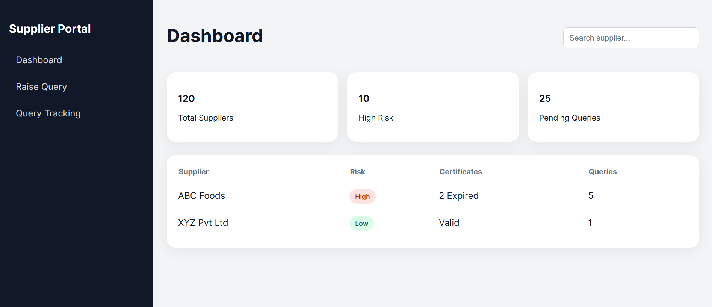

# 🧾 Supplier Query Management Portal

A modern UI-based web application designed to streamline supplier food safety queries for QA teams. This project centralizes supplier data, query tracking, and communication into a single, intuitive dashboard.

---

## 🚀 Live Demo
🔗 Deployment Link: https://supplier-portal-rho.vercel.app/

---

## 📂 GitHub Repository
🔗 Repo Link: https://github.com/PruthviAlva/supplier-portal.git

---

## 🎯 Objective

Food safety teams often struggle with fragmented systems (emails, spreadsheets, calls) to manage supplier compliance and queries.

This application solves that by providing:
- A centralized dashboard
- Query submission and tracking
- Supplier compliance visibility
- Easy communication interface

---

## ✨ Features

### 🟢 Supplier Dashboard
- Overview of all suppliers
- Risk indicators (High / Low)
- Certificate status
- Pending query count

### 🟡 Raise New Query
- Select supplier and query type
- Predefined query categories (Allergen, HACCP, etc.)
- Input message and submit query

### 🔵 Query Tracking
- View all queries in one place
- Status indicators:
  - Pending
  - In Review
  - Resolved

### 🟣 Query Detail Page
- Chat-style communication interface
- View query history
- Send replies

---

## 🧭 User Flow


Dashboard → Select Supplier → Raise Query → Track Query → View Details → Resolve


---

## 🛠️ Tech Stack

- **Frontend:** React.js
- **Routing:** React Router DOM
- **Styling:** CSS (Custom, no external UI library)
- **Deployment:** Vercel

---

## 🎨 UI/UX Design Decisions

- **Sidebar Layout:** Enables easy navigation across modules
- **Card-Based Design:** Highlights key metrics (suppliers, risks, queries)
- **Table Structure:** Organizes supplier and query data clearly
- **Status Badges:** Color-coded for quick understanding
- **Minimal Design:** Focus on clarity and usability over complexity

---

## ⚡ How It Reduces User Friction

- Centralized data → No need to switch between tools
- Quick query submission → Saves time
- Visual status indicators → Easy tracking
- Clean layout → Improves readability and focus

---

## ♿ Accessibility Considerations

- High contrast colors for readability
- Clear labels and structured layout
- Consistent spacing and font sizes
- Buttons and inputs are easy to interact with

---

## 📦 Installation & Setup

Clone the repository:

```bash
git clone https://github.com/your-username/supplier-portal.git
cd supplier-portal

Install dependencies:

npm install

Run the app:

npm start
🚀 Deployment

This project is deployed using Vercel:


📌 Future Improvements

Backend integration (Node.js / Express)

Real-time chat with suppliers

File upload for certificates

Advanced filters and search

Notifications for expiring certificates

🙌 Conclusion

This project demonstrates a clean and scalable UI solution for managing supplier food safety queries. It focuses on usability, clarity, and reducing operational friction for QA teams.


---

   - 

---
